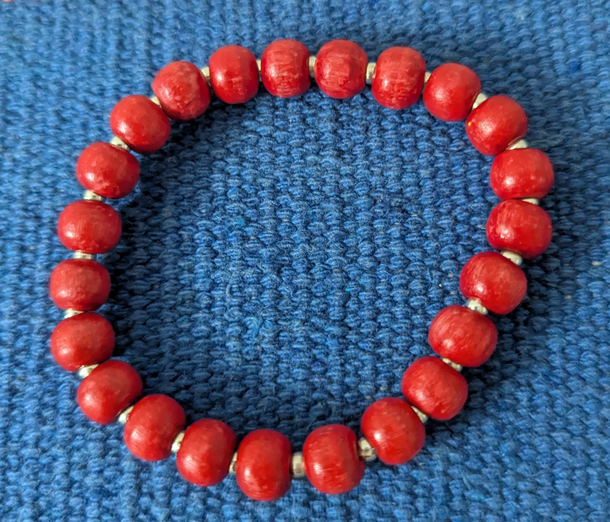
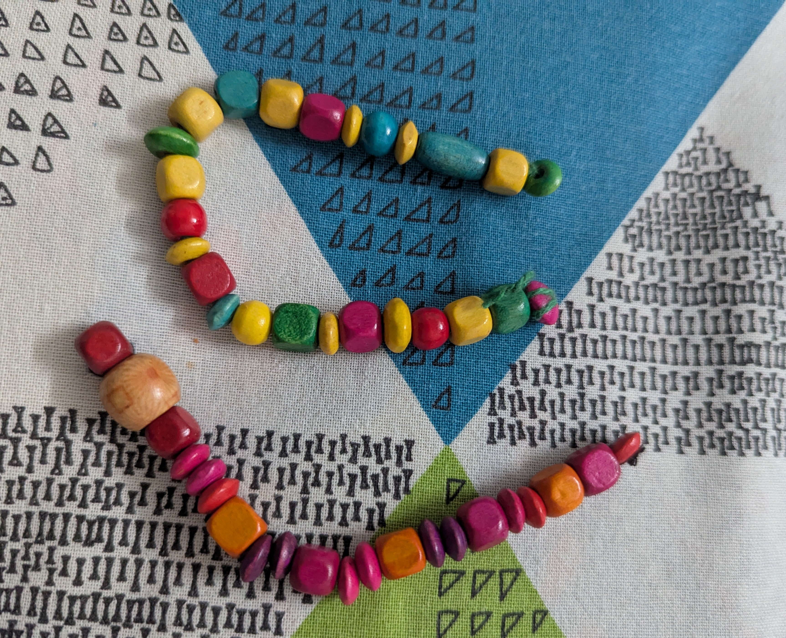

<section class="products-section">
    

        <h1>Handmade Bangles & Bracelets</h1>
        
Explore our unique collection of handmade bangles and bracelets.

        
        

            

                
                <h3>Bangle 1</h3>
                
Beautiful handmade bangle with intricate design.

                
₹500

                <button class="button primary" onclick="openRazorpay('Bangle 1', 500)">Buy Now</button>
            

            
            

                
                <h3>Bracelet 1</h3>
                
Elegant handmade bracelet with modern style.

                
₹750

                <button class="button primary" onclick="openRazorpay('Bracelet 1', 750)">Buy Now</button>
            

        

    

</section>

 